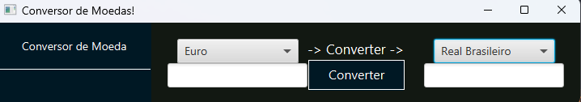

   

  <a aria-label="Completed" href="https://www.oracle.com/br/education/oracle-next-education/">
    </img>
  </a>
  

  

  Challange Conversor of Oracle One. Made with ❤︎
    </a>
  

# :pushpin: Index

- [What is this Repo?](#sparkles_What-is-this-Repo?)
- [How to test](#clipboard_How-to-test)
- [Technologies](#computer_Technologies)
- [Find a Bug? Or somenthing need to change?](#bug_Issues?)

# :sparkles: What is this Repo?

This is a challenge proposed in the oracle one next education course, in this challenge we have to make a simple conversor program in with JAVA swing or javafx, I choose javafx.

# :clipboard: How to test

To test this please open with intelligei and run it!~

final screen:

## :computer: Technologies

- [JAVA](https://www.java.com/pt-BR/)
- [JAVAFX](https://openjfx.io)
- [Api de moedas](https://docs.awesomeapi.com.br/api-de-moedas)

# :bug: Issues?

Please feel free **to create a new issue** with its title and description on the issues page of the [BenchMark](https://github.com/luizlcezario/OracleOne_Challenge_Conversor/issues) Repository. If you have already found the solution to the problem, **I would love to review your pull request**!

Give ⭐️ if you like this project, this will help me!
